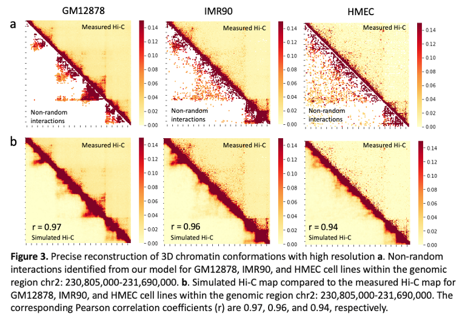

# Constructing High-Resolution Ensemble Models of 3D Single-Cell Chromatin Conformations of eQTL Loci from Integrated Analysis of 4DN-GTEx Data Towards the Structural Basis of Differential Gene Expression

A computational pipeline to identify non-random interactions and reconstruct 3D chromatin structures of modeled single cells from Hi-C data.

<!-- ABOUT THE PROJECT -->
## About The Project
Genome-wide association studies (GWASs) have identified thousands of loci associated with complex traits. However, a significant majority of these loci are located in non-coding regions, and the functional implications of these variants remain ambiguous. Addressing this gap, Expression quantitative trait loci (eQTL) studies establish associations between genetic variants and variations in gene expression levels. This increasingly reveals the pivotal role of non-coding Single Nucleotide Polymorphisms (SNPs) in influencing gene regulation, thus contributing to the broad spectrum of phenotypic diversity and various human disorders. Despite this insight, the precise mechanisms by which eQTL variants exert their influence on the expression of target genes remain elusive. Conversely, chromatin spatial organization analyses, such as Hi-C, reveal the importance of three-dimensional chromatin interactions in gene regulation. These two complementary approaches focus on different aspects of gene regulation. Together, these approaches offer a comprehensive resource to gain a mechanistic understanding of the interplay between genetic elements and their spatial organization.

In this project, we develop a computation method to integrate both eQTL and Hi-C data that are available through GTEx and 4DN respectively. Using Hi-C data, we identified pairwise statistically significant chromatin interaction using the random polymer ensemble as the null distribution. These identified interactions are then used to generate folded 3D chromatin conformations. The aggregation of our single-cell chromatin models reproduces Hi-C measurements well. The reconstructed ensembles of single-cell chromatin structures enable us to discover non-random and direct higher-order many-body specific interactions between eQTL and target genes.

<!-- GETTING STARTED -->
## Step 1. Identify non-random interactions from Hi-C data
Download raw HiC data from 4DN and follow the instructions on [CHROMATIX](https://bitbucket.org/aperezrathke/chr-loc-mbi-mam/src/master/) to identify the non-random interactions of selected loci. 

### The output files of non-random interactions shows below:

Here is an example specific interaction output file for GM12878 in chr2: 230805000 - 231690000

| i1 | j1 | fq | pval | fdr | bon | ibp | jbp | rawc |
|-----------------|-----------------|-----------------|-----------------|-----------------|-----------------|-----------------|-----------------|-----------------|
| 2 | 7  | 0.8018  | 0 | 0  | 0 | 230810000  | 230835000 | 124.9943  |
| 3 | 10  | 0.4422  | 0 | 0  | 0 | 230815000  | 230850000 | 94.6058  |
| ... | ...  | ... | ... | ...  | ... | ...  | ... | ...  |

For each file, there are 9 columns:
- i1 - beads index of first contacting locus
- j1 - beads index of second contact locus (j1 >= i1)
- fq - quantile normalized frequency
- pval - upper-tail p-value of (i,j) contact according to quantile normalized frequency
- fdr - false discovery rate adjusted p-value
- bon - bonferroni corrected p-value
- ibp - start base pair of first interacting loci
- jbp - start base pair of second interacting loci
- rawc - observed raw contact counts

More details see [sample_data](sample_data/specific_interactions)

## Step 2. Prepare input file to reconstruct 3D chromatin chains

Run [get_folding_input_file](scr/) to get the input file to reconstruct 3D chromatin chains.

### The input file to reconstruct 3D chromatin chains shows below:

| chr | ibp | jbp | fq | w |
|-----------------|-----------------|-----------------|-----------------|-----------------|
| chr2 |	230870000	| 231020000 | 0.3072 | 1 |
| chr2	| 230870000	| 231025000 |	0.2462 | 1 |
| ...	| ...	| ...	| ... | ... |

For each file, there are 5 columns:
- chr - chromosome numbber 
- ibp - start base pair of first interacting loci
- jbp - start base pair of second interacting loci
- fq - quantile normalized frequency
- w - weights for the non-random interactions

More details see [folding_data](sample_data/folding_input)

## Step 3. Reconstruct 3D chromatin structures
Using the input files generated from Step 2, and following the instructions of [sBIF](https://github.com/qiusun0215/sBIF) to reconstruct 3D chromatin chains

### Output Data

Here is an example reconstructed chromatin chain output file for GM12878 in chr2: 230805000 - 231690000

| x | y | z |
|-----------------|-----------------|-----------------|
| 117.487545 | 264.050678 | -716.514965 |
| 116.180734 | 294.913744	| -701.624534 |
| ... | ...  | ... |

- Each file represents a single 3D chromatin chain. 
- 3 columns represent the center of beads x y z in 3D separately. 
- Each row represents a 5kb genomic region.

More details see [chromatin chain](sample_data/3D_chromatin_chains)

If using this software, please cite:

- Perez-Rathke, Alan, Qiu Sun, Boshen Wang, Valentina Boeva, Zhifeng Shao, and Jie Liang. "CHROMATIX: computing the functional landscape of many-body chromatin interactions in transcriptionally active loci from deconvolved single cells." Genome Biology 21, no. 1 (2020): 1-17. https://doi.org/10.1186/s13059-019-1904-z.
- Sun, Qiu, Alan Perez-Rathke, Daniel M. Czajkowsky, Zhifeng Shao, and Jie Liang. "High-resolution single-cell 3D-models of chromatin ensembles during Drosophila embryogenesis." Nature communications 12, no. 1 (2021): 205.
